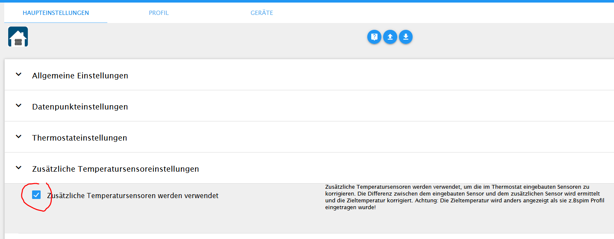
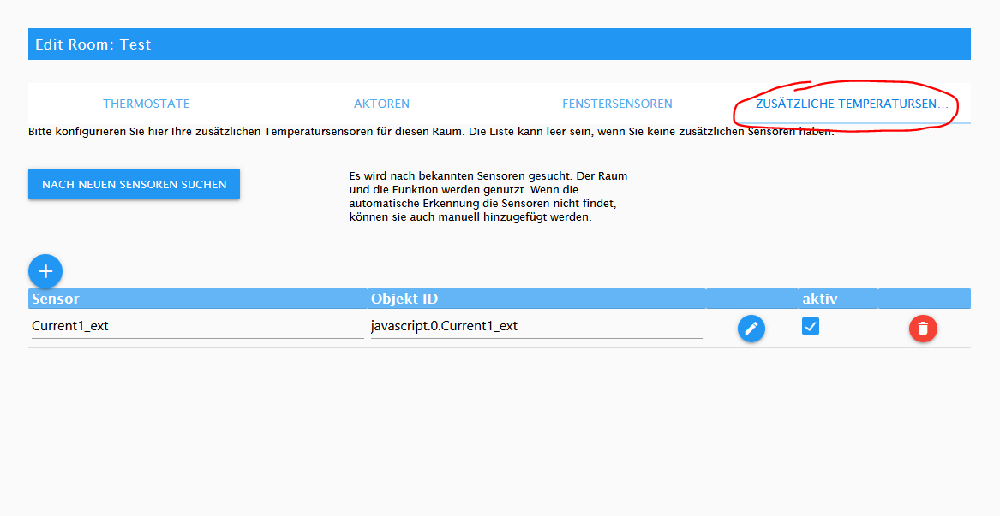

#use cases

## Temperature-Offset
Sometimes there is a desire to use a separate temperature sensor to control a thermostat. This is usually the case
when the sensor built into the thermostat detects a significantly different temperature than what you feel in the room.
Ideally, a direct link between the thermostat and the external sensor is used in this case. This works with devices from the same
Manufacturers mostly good (e.g. Homematic).
But if you have devices from different manufacturers, this usually doesn't work. Unfortunately you can also see the actual temperature in the thermostat from the outside
do not change (write).
The adapter therefore offers the option of setting the target temperature based on the difference between the thermostat's internal sensor and any external sensor
Correct temperature sensor.
The adapter regularly determines the difference between the two sensors and forms a moving average of the difference. This mean
is called
heatingcontrol.0.Rooms.Raum.TemperatureOffset
saved per room. Each time the target temperature is set, this temperature offset is added to the actual target temperature.
Attention: the mean value can change, but it is only added to the target temperature if the target temperature is changed according to the plan (profile point, window open, ...)

If more than one sensor is used, an average value is formed over all sensors. 

### Configuration
First the feature has to be activated: 

In the configuration menu of the room there is then the tab "Additional temperature sensors" 

You can either search for sensors here. Alternatively, the sensor (s) can also be entered manually.  
